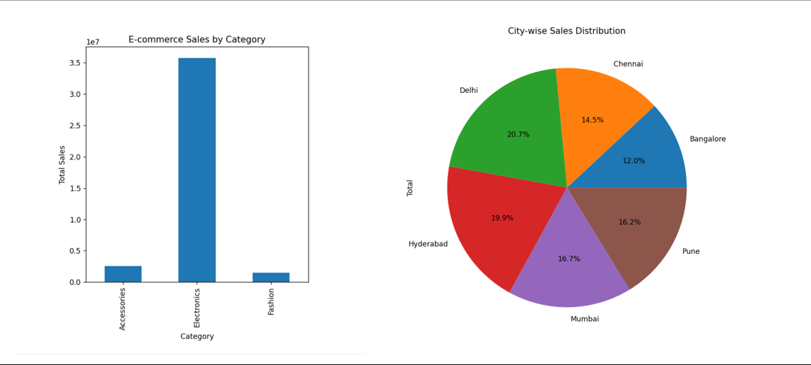

# 🛒 E-commerce Sales Analysis

## 📊 Project Overview
This project analyzes E-commerce sales data using Python.
It performs data cleaning, analysis, and visualization to generate business insights.

## 🚀 Features
- Total Revenue Calculation
- Category-wise Sales Analysis
- City-wise Sales Analysis
- Data Visualization using Matplotlib

## 🧰 Technologies Used
- Python
- Pandas
- Matplotlib

## 📁 Project Structure

ecommerce-sales-analysis/
│
├── analysis.py
├── ecommerce_sales.csv
├── requirements.txt
└── README.md

## ▶️ How to Run

Install dependencies:
pip install -r requirements.txt

Run project:
python analysis.py

## 📈 Output
- Sales insights in console
- Bar chart visualization
- Pie chart visualization

## 📊 Sample Output

## 👨‍💻 Author
Karan Samudra
